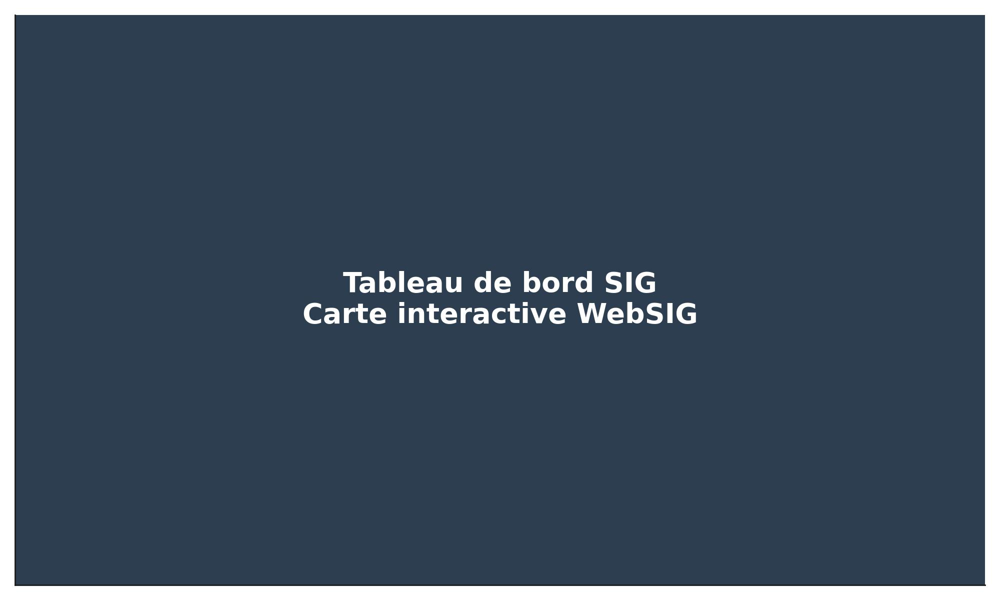

# 🌍 Tableau de bord SIG - Projets de Développement

Ce projet présente une **carte interactive WebSIG** permettant le **suivi de projets de développement** dans une zone géographique spécifique.  
Elle intègre la géolocalisation, des indicateurs clés (montant, avancement, partenaire), des filtres interactifs et des graphiques.

---

## 🔗 Accès en ligne

👉 [Voir la carte interactive en ligne](https://djibril1986.github.io/dashboard-sig-projets/)

---

## 🖼️ Aperçu

---

## ⚙️ Fonctionnalités

- Carte interactive Leaflet (OpenStreetMap)
- Données GeoJSON personnalisées
- Filtres dynamiques par statut
- Graphique de répartition par avancement (Chart.js)
- Export GeoJSON des projets visibles
- Interface esthétique avec menu latéral

---

## 🛠️ Technologies utilisées

- HTML, CSS, JavaScript
- Leaflet.js
- Chart.js
- GitHub Pages (hébergement)

---

## 👤 Auteur

**Abedi Kizenga Djibril**  
🔗 [Profil LinkedIn](https://www.linkedin.com/in/djibril-abedi-kizenga-1aa09b168/)

---

## 📄 Licence

Ce projet est open-source à des fins pédagogiques.
